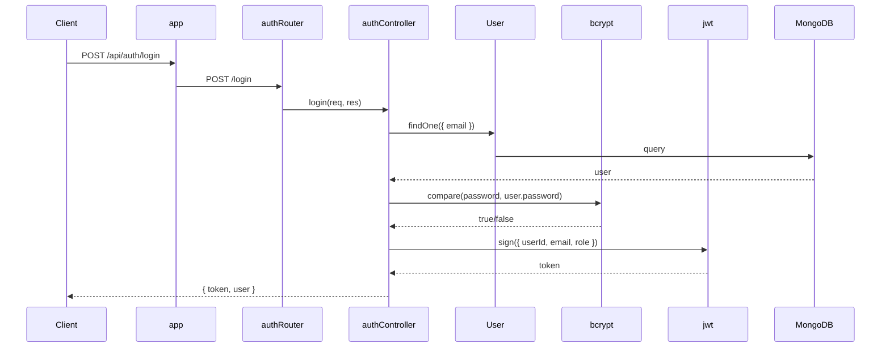
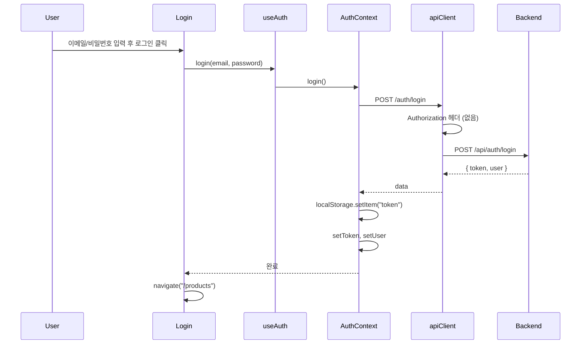
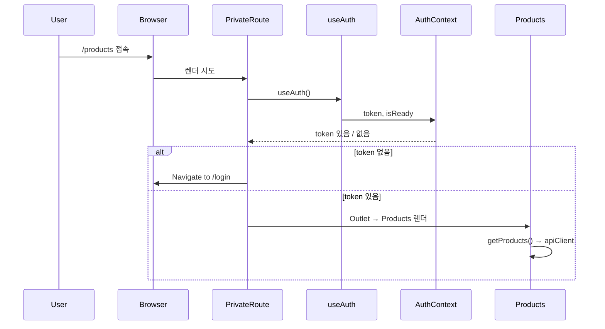

# TypeScript +  Express + MongoDB 웹 서비스

React SPA 프론트엔드와 Node.js/Express 백엔드, MongoDB(Mongoose)를 사용한 풀스택 웹 서비스입니다.

---

## 기술 스택


| 구분           | 기술                                           |
| ------------ | -------------------------------------------- |
| **Frontend** | React, TypeScript, Vite, React Router, Axios |
| **Backend**  | Node.js, Express, TypeScript                 |
| **DB**       | MongoDB, Mongoose                            |
| **인증**       | JWT, bcrypt                                  |
| **배포**       | AWS (Elastic Beanstalk + S3)                 |


---

## 결과 화면


---

## 프로젝트 구조

```
deploy/
├── backend/                 # API 서버
│   ├── src/
│   │   ├── config/         # DB 연결
│   │   ├── controllers/    # 비즈니스 로직
│   │   ├── middleware/     # 인증 미들웨어
│   │   ├── models/         # Mongoose 스키마
│   │   ├── routes/         # 라우터
│   │   ├── app.ts
│   │   └── server.ts
│   ├── package.json
│   └── tsconfig.json
├── frontend/                # React SPA
│   ├── src/
│   │   ├── api/            # API 클라이언트
│   │   ├── components/     # 공통 컴포넌트
│   │   ├── context/        # 전역 상태 (Auth)
│   │   ├── pages/          # 페이지 컴포넌트
│   │   ├── App.tsx
│   │   └── main.tsx
│   ├── package.json
│   └── vite.config.ts
└── README.md
```

---

# Backend 구조 및 플로우

## 1. 진입점 및 앱 구성

- **server.ts**: `dotenv` 로드 → `connectDB()` → `http.createServer(app)` → `listen(PORT)`
- **app.ts**: CORS, `express.json()`, `GET /health`, `app.use("/api", routes)`
- **routes/index.ts**: `/api/auth`, `/api/products`, `/api/videos` 로 라우터 분기

## 2. Backend 호출 관계 요약


| 경로                       | Route         | Middleware     | Controller                        | Model   |
| ------------------------ | ------------- | -------------- | --------------------------------- | ------- |
| POST /api/auth/register  | auth.route    | -              | auth.controller.register          | User    |
| POST /api/auth/login     | auth.route    | -              | auth.controller.login             | User    |
| POST /api/products       | product.route | authMiddleware | product.controller.createProduct  | Product |
| GET /api/products        | product.route | authMiddleware | product.controller.getProducts    | Product |
| GET /api/products/:id    | product.route | authMiddleware | product.controller.getProductById | Product |
| PUT /api/products/:id    | product.route | authMiddleware | product.controller.updateProduct  | Product |
| DELETE /api/products/:id | product.route | authMiddleware | product.controller.deleteProduct  | Product |
| POST /api/videos         | video.route   | authMiddleware | video.controller.createVideo      | Video   |
| GET /api/videos/search   | video.route   | -              | video.controller.searchVideos     | Video   |


## 3. Backend 시퀀스 (로그인 예시)




---

# Frontend 구조 및 플로우

## 1. 진입점 및 앱 구성

- **main.tsx**: `createRoot` → `App` 렌더링, `index.css` 로드
- **App.tsx**: `AuthProvider`로 감싼 뒤 `BrowserRouter` + `Routes` 설정
- **라우트**: `/login`, `/register`는 공개, `/`, `/products`, `/videos`는 `PrivateRoute`로 보호

## 2. Frontend 파일별 역할


| 파일/폴더                       | 역할                               |
| --------------------------- | -------------------------------- |
| main.tsx                    | React 마운트, App 렌더링               |
| App.tsx                     | AuthProvider, Router, Route 정의   |
| context/AuthContext.tsx     | 로그인 상태, login/logout, token 보관   |
| components/PrivateRoute.tsx | token 없으면 /login으로 리다이렉트         |
| api/client.ts               | Axios 인스턴스, 토큰 헤더, 401 시 로그아웃 처리 |
| api/auth.ts                 | register, login API 호출           |
| api/product.ts              | Product CRUD API 호출              |
| api/video.ts                | Video 검색/등록 API 호출               |
| pages/Login.tsx             | 로그인 폼, useAuth().login 호출        |
| pages/Register.tsx          | 회원가입 폼, auth.register 호출         |
| pages/Products.tsx          | 상품 목록/추가/삭제, 본인 상품만 삭제 버튼 표시     |
| pages/VideoSearch.tsx       | 비디오 등록 폼, 검색 폼 및 결과              |


## 3. Frontend 시퀀스 (로그인 플로우)




## 4. Frontend 시퀀스 (Private 라우트 접근)




---

## 로컬 실행 방법

### 백엔드

```bash
cd backend
npm install
# .env 설정: PORT, MONGODB_URI, JWT_SECRET
npm run dev
```

### 프론트엔드

```bash
cd frontend
npm install
# .env: VITE_API_URL=http://localhost:4000
npm run dev
```

- 백엔드: [http://localhost:4000](http://localhost:4000)  
- 프론트: [http://localhost:5173](http://localhost:5173)

---

## 환경 변수

### backend/.env


| 변수          | 설명              |
| ----------- | --------------- |
| PORT        | 서버 포트 (기본 4000) |
| MONGODB_URI | MongoDB 연결 문자열  |
| JWT_SECRET  | JWT 서명용 시크릿     |


### frontend/.env


| 변수           | 설명                                                              |
| ------------ | --------------------------------------------------------------- |
| VITE_API_URL | 백엔드 API URL (예: [http://localhost:4000](http://localhost:4000)) |


---

## 배포

- **백엔드**: AWS Elastic Beanstalk (Node.js)
- **프론트엔드**: AWS S3 정적 웹사이트 호스팅
- **DB**: MongoDB Atlas

프론트와 백엔드 모두 HTTP인 경우 Mixed Content를 피하려면 같은 프로토콜(예: S3 HTTP + EB HTTP)로 맞추거나, HTTPS를 적용해 사용합니다.
